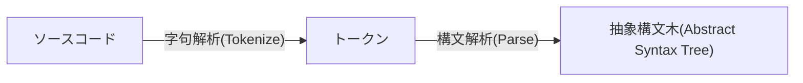
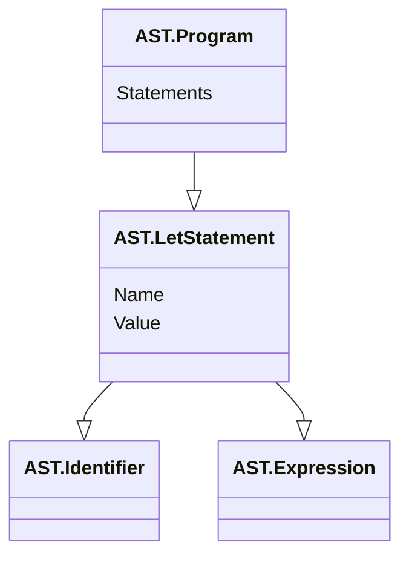

Julia 1.10からデフォルトのパーサーが[JuliaSyntax.jl](https://github.com/JuliaLang/JuliaSyntax.jl)になったことを知り、プログラムってどうやって実行されているか知らないなーと思った。構文解析や字句解析という言葉を聞いたことはあり、ASTがどのようなものかふんわりと知っている。ー[Go言語でつくるインタプリタ](https://www.oreilly.co.jp/books/9784873118222/)を読んでみることにした。

この本では、C-likeな言語である独自言語、Monkey言語のインタプリタを実装するらしい。本の中ではタイトル通りGoでインタプリタが実装されているけど、自分はGoを使ったことがない。写経をしてもなにも身につかない気がしたので、一旦書き慣れているPythonで実装することにした。

## 1章 字句解析

### 1.1 字句解析

ソースコードは以下の流れで変換される。ダークモードだと見えにくいかもしれない。まだmermaidの色を調整していない。
字句解析はスキャナーと呼ばれることもある。



Monkeyでは行番号と列番号を無視してASTを構成する。

### 1.2 トークンの実装

スキップ。

### 1.3 字句解析器（レキサー）

### 1.4 トークン集合の拡充と字句解析器の拡張

### 1.5 REPLのはじまり

## 2章 構文解析

1章で実装したTokenizerをもとに、構文解析器を実装する。

### 2.1 構文解析器（パーサー）

JSONパーサーもプログラミング言語のパーサーも大差ないらしい。文字列を適切な形で木構造にするだけなので、まあそうなんだろうなと思った。ASTがなぜ*抽象*なのかというと、セミコロンや改行コードといった情報がないから。

### 2.2 パーサージェネレータじゃないの？

先人が作った、一般化されたパーサージェネレータが存在する。パーサージェネレータは文法を定義するだけで、パーサーを生成してくれる。その多くは文脈自由文法(Context-Free Grammer, CFG)をinputとしているらしい。CFGという単語は聞いたことがなかったが、Backus-Naur Form(BNF)記法やExtended-BNF記法はCFGの一種らしい。BNF記法なら聞いたことがある！

パーサージェネレータという先人の発明があったとして、手を動かして学ぶことに意味はある、と筆者は言っている。僕もそう思う。やってみてわかることも多い。

### 2.3 Monkey言語のための構文解析器を書く

パーサーにはトップダウン構文解析とボトムアップ構文解析がある。その違いは、ルートから攻めるかリーフから攻めるかの違い。Monkey言語のパーサーはトップダウン構文解析を採用する。

### 2.4 構文解析器の第一歩: let文

Monkeyでは変数の束縛を以下の形で行う。式は値を生成するが、文は値を生成しない。式と文の定義は厳密ではない。
```c
let 識別子 = 式;
```

ASTを作るには、式ノードと文ノードが必要になりそう。



ASTを作るためのパーサーを実装する。以下は疑似コード。

```python
def parse_program():
    # パース開始
    # ルートノードになるプログラムノードを作成
    program = new_program_ASTNode()

    # トークンを進める
    advance_tokens()

    while current_token() != EOF_TOKEN:
        statement = None
        # 現在のトークンによってパースの方法を変える
        match current_token():
            case LET_TOKEN:
                # let文をパース
                statement = parse_let_statement()
            case RETURN_TOKEN:
                # return文をパース
                statement = parse_return_statement()
            case IF_TOKEN:
                # if文をパース
                statement = parse_if_statement()
            case _:
                pass
        if statement:
            program.statements.append(statement)
        # トークンを進める
        advance_tokens()
    return program

def parse_let_statement():
    advance_tokens()
    identifier = parse_identifier()
    advance_tokens()
    if current_token() != EQUAL_TOKEN:
        raise ParseError("No equal sign!")
    advance_tokens()

    value = parse_expression()
    variable_statement = new_variable_statement_AST_node()
    variable_statement.identifier = identifier
    variable_statement.value = value
    return variable_statement

def parse_expression():
    if current_token() == INT_TOKEN:
        if next_token() == PLUS_TOKEN:
            return parse_operator_token()
        elif next_token() == SEMICOLON_TOKEN:
            return parse_integer_token()
    elif current_token() == LEFT_PAREN:
        return parse_grouped_expression()
        ...
```
